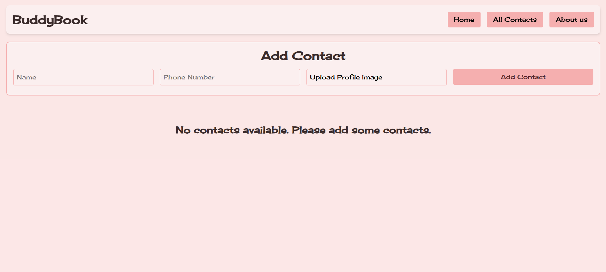
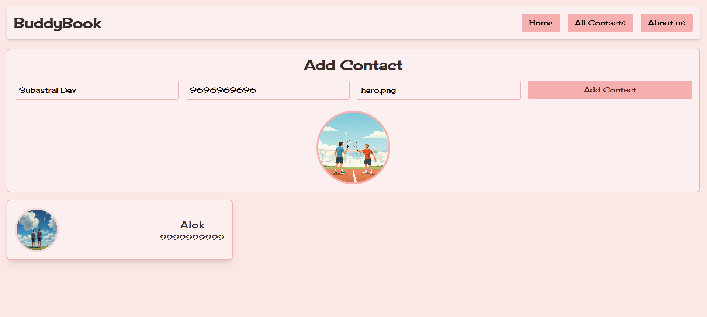
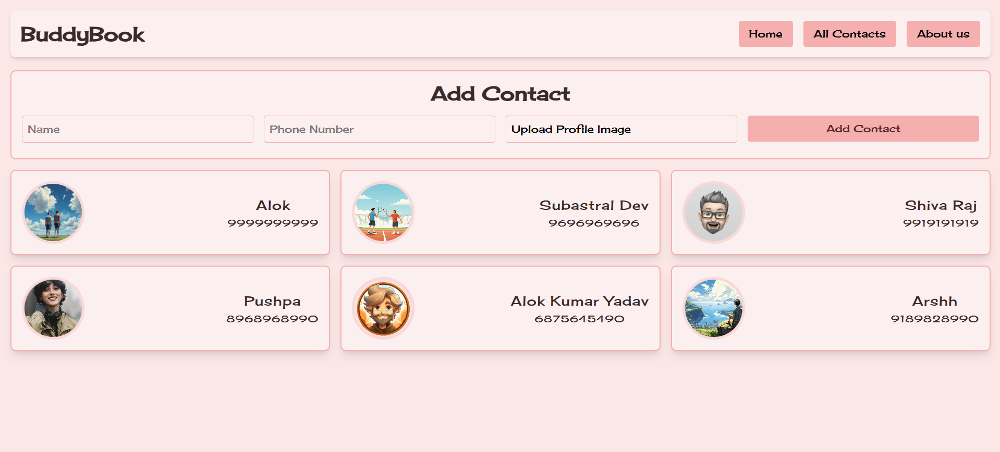

# 📇 BuddyBook

A modern, intuitive contact management application built with **React** and **Tailwind CSS**. Manage your contacts efficiently with a sleek, responsive interface.

---

## ✨ Features

- 📝 **Add Contacts** - Easily add new contacts with name, phone number, and profile image
- 🖼️ **Profile Pictures** - Upload custom profile images or use the default avatar
- 🎨 **Modern UI** - Beautiful, responsive design with smooth animations
- 💾 **Real-time Updates** - Instant feedback when adding or managing contacts
- 📱 **Fully Responsive** - Works perfectly on desktop, tablet, and mobile devices
- ⚡ **Fast Performance** - Built with Vite for lightning-fast development and production builds
- 💾 **Local storage persistence** - To store locally

---

## 📸 Preview

### Desktop View






---

## 🛠️ Tech Stack

- **React 19** - Modern UI library
- **Vite** - Next-generation build tool
- **Tailwind CSS 4** - Utility-first CSS framework
- **JavaScript ES6+** - Latest JavaScript features

---

## 📦 Installation

1. **Clone the repository**
   ```bash
   git clone https://github.com/AlokKumarYadav2410/buddy-book.git
   cd buddy-book
   ```

2. **Install dependencies**
   ```bash
   npm install
   ```

3. **Start the development server**
   ```bash
   npm run dev
   ```

4. **Open in browser**
   ```
   http://localhost:5173
   ```

---

## 📖 Usage

### Adding a Contact
1. Fill in the contact form with:
   - Contact name
   - Phone number
   - Profile image (optional)
2. Click "Add Contact"
3. Your contact appears instantly in the list

### Managing Contacts
- View all your contacts in a clean card layout
- Each contact card displays name, phone number, and profile image
- Hover over cards for smooth animations and interactive feedback

---

## 🚀 Available Scripts

- `npm run dev` - Start development server
- `npm run build` - Build for production
- `npm run preview` - Preview production build
- `npm run lint` - Run ESLint to check code quality

---

## 📁 Project Structure

```
buddy-book/
├── src/
│   ├── Components/
│   │   ├── ContactCard/      # Individual contact card component
│   │   ├── ContactForm/      # Form for adding contacts
│   │   └── Navbar/           # Navigation bar
│   ├── assets/               # Images and static files
│   ├── App.jsx               # Main app component
│   ├── index.css             # Global styles
│   └── main.jsx              # Entry point
├── public/                   # Static public files
├── vite.config.js           # Vite configuration
├── tailwind.config.js       # Tailwind configuration
└── package.json             # Project dependencies
```

---

## 🎨 Customization

### Change Colors
Edit your Tailwind CSS variables in your CSS files to customize the color scheme. The app uses CSS custom properties for theming:
- `--btn-main` - Primary button color
- `--bg-card` - Card background color
- `--bg-main` - Main background color
- `--text-main` - Text color

### Styling
The project uses Tailwind CSS utility classes for responsive design. Modify component classes to change layouts and styles.

<!-- ---

## 🌟 Future Enhancements

- 🔍 Search and filter contacts
- ✏️ Edit existing contacts
- 🗑️ Delete contacts
- 🔐 User authentication -->

---

## 📝 License

This project is open source and available under the MIT License.

---

## 👨‍💻 Development

This project was created as part of a React learning journey. It demonstrates:
- Component-based architecture
- Form handling in React
- Responsive design with Tailwind CSS
- State management
- Reusable components

---

## 🤝 Contributing

Contributions are welcome! Feel free to:
1. Fork the repository
2. Create a feature branch
3. Commit your changes
4. Push to the branch
5. Open a Pull Request

---

## 📞 Support

For any questions or issues, feel free to open an issue in the repository.

---

**Happy Contact Managing! 🎉**